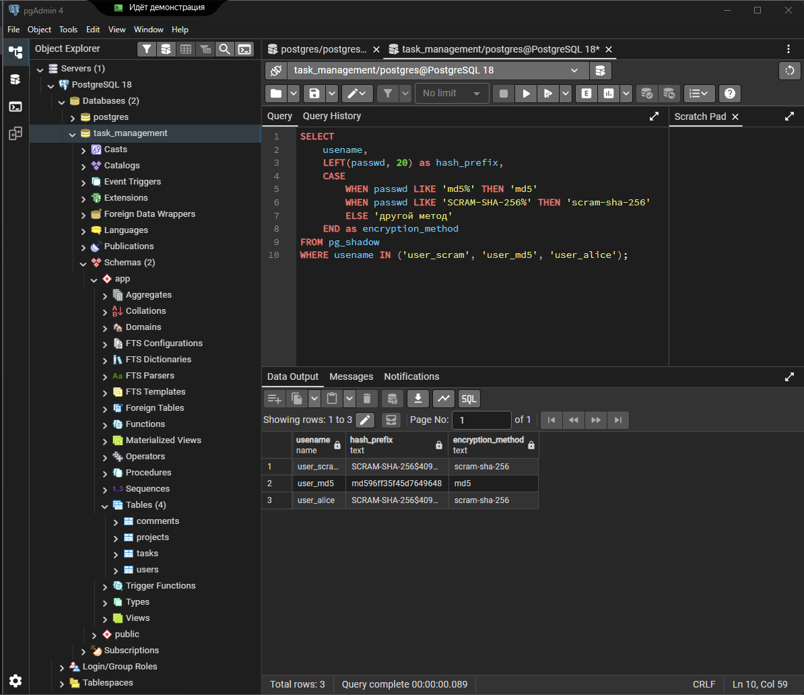
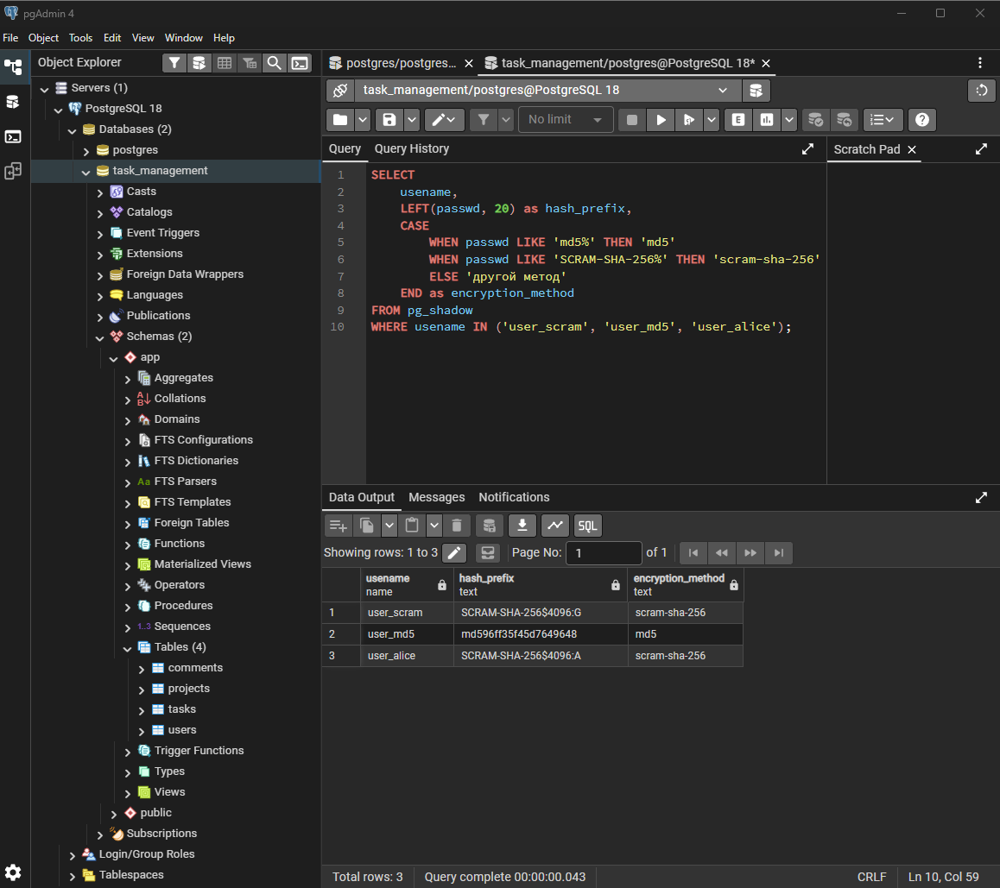
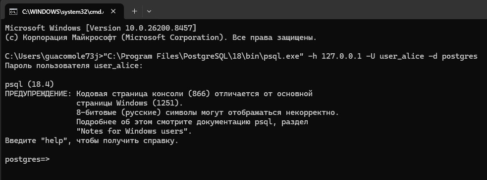
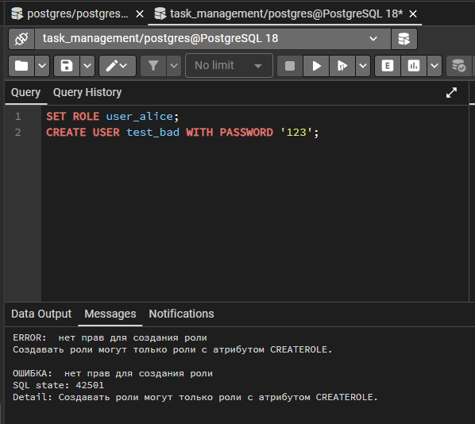

# Практическая работа №3: Настройка аутентификации в PostgreSQL

**Выполнила:** Еременко Анастасия  
**Группа:** 607-41  
**Дата:** 26.05.2026  

---

## Что такое аутентификация?

Аутентификация — это проверка пароля при подключении к базе данных.

---

## Конфигурация pg_hba.conf

В файле `pg_hba.conf` настроены следующие правила:

| Тип | База данных | Пользователь | Адрес | Метод |
|-----|-------------|--------------|-------|-------|
| local | all | all | — | scram-sha-256 |
| host | all | all | 127.0.0.1/32 | scram-sha-256 |

📄 [Файл pg_hba.conf](pg_hba.conf)

**Вывод:** сервер требует пароль и использует безопасный метод `scram-sha-256`.

---

## Тестовые пользователи

| Пользователь | Метод шифрования |
|--------------|------------------|
| user_scram | scram-sha-256 |
| user_md5 | md5 |
| user_alice | scram-sha-256 |

Скриншот создания пользователей: 

Скриншот методов шифрования: 

---

## Проверка подключения

Подключение от пользователя `user_alice`:

```bash
psql -h 127.0.0.1 -U user_alice -d postgres
```

Пароль: `AlicePassword456!`

**Результат:** подключение успешно. Значит, аутентификация работает правильно.
Скриншот успешно: 


Скриншот ошибки: 


---

## Итог: сравнение методов

| Метод | Безопасность | Когда использовать |
|-------|--------------|-------------------|
| scram-sha-256 | ✅ Высокая | Всегда в production |
| md5 | ❌ Низкая | Не использовать |
| trust | ❌ Отсутствует | Только дома/на учебе |

---

## Вывод

В работе настроена аутентификация через `scram-sha-256` — это правильный и безопасный подход. Пользователи созданы, подключение проверено, всё работает.
