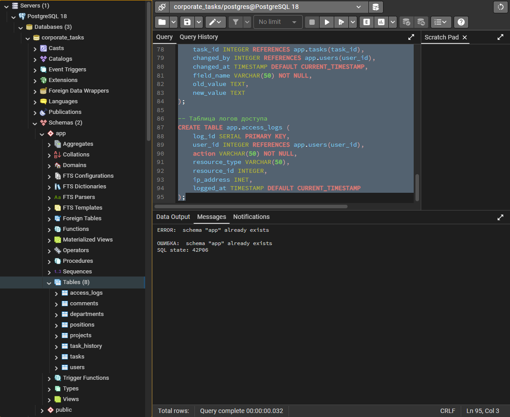
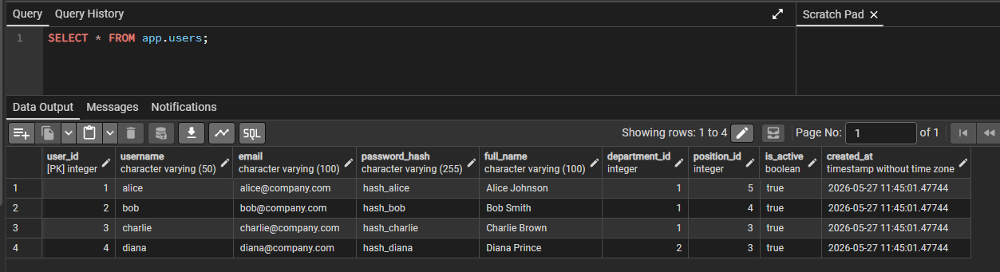
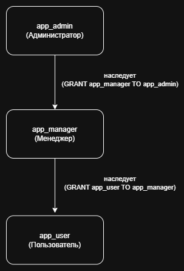
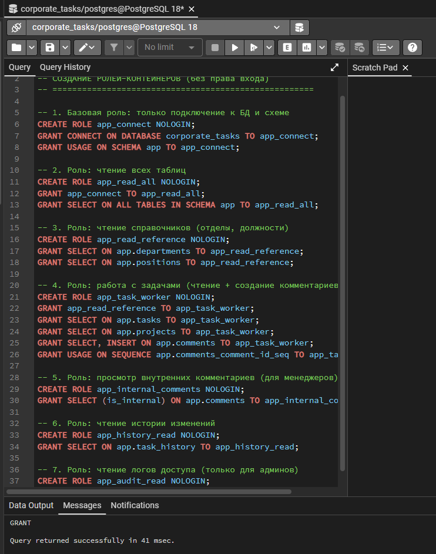
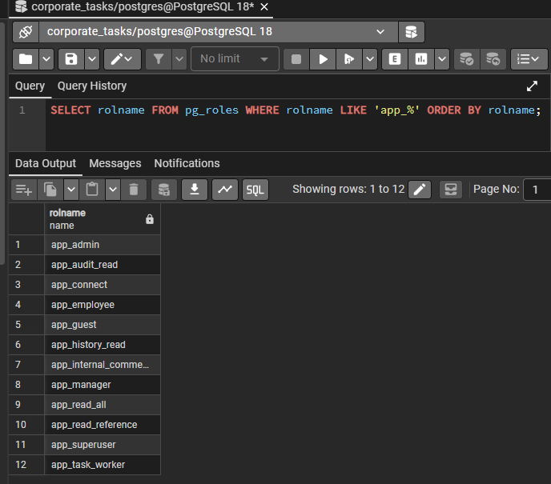

# Практическая работа №4: Создание иерархии ролей

**Выполнила:** Еременко Анастасия  
**Группа:** 607-41  
**Дата:** 27.05.2026  

---

## Часть 1: Подготовка базы данных

### Задание 1.1: Создание базы данных и схемы

Создана база данных `corporate_tasks` со схемой `app` и таблицами:

- `departments` — отделы
- `positions` — должности
- `users` — пользователи
- `projects` — проекты
- `tasks` — задачи
- `comments` — комментарии
- `task_history` — история изменений
- `access_logs` — логи доступа

Скриншот базы данных: 

**Тестовые данные:**

Таблица `users` заполнена 4 пользователями:

| user_id | username | full_name | department | position |
|---------|----------|-----------|------------|----------|
| 1 | alice | Alice Johnson | IT | Manager |
| 2 | bob | Bob Smith | IT | Senior |
| 3 | charlie | Charlie Brown | IT | Specialist |
| 4 | diana | Diana Prince | Marketing | Specialist |

Скриншот таблицы users: 

---

## Часть 2: Проектирование иерархии ролей

### Задание 2.1: Матрица привилегий

| Объект / Операция | app_user | app_manager | app_admin |
|-------------------|----------|-------------|-----------|
| users — SELECT | Только свои данные | Все пользователи | Все |
| users — INSERT/UPDATE | — | — | ✅ |
| projects — SELECT | Свои проекты | Все проекты | Все |
| projects — INSERT/UPDATE | — | Свои проекты | Все |
| tasks — SELECT | Свои задачи | Все задачи | Все |
| tasks — INSERT | — | В свои проекты | Все |
| tasks — UPDATE | Статус своих задач | Любые поля | Все |
| tasks — DELETE | — | Свои проекты | Все |
| comments — SELECT | Не-внутренние | Все | Все |
| comments — INSERT/UPDATE | Свои комментарии | Все | Все |
| task_history — SELECT | — | Свои проекты | Все |
| access_logs — SELECT | — | — | ✅ |
| DDL операции | — | — | ✅ |

### Задание 2.2: Диаграмма иерархии ролей



---

## Часть 3: Реализация системы ролей

### Задание 3.1: Роли-контейнеры (без LOGIN)

Созданы роли: `app_connect`, `app_read_all`, `app_read_reference`, `app_task_worker`, `app_internal_comments`, `app_history_read`, `app_audit_read`

Скриншот: 

### Задание 3.2: Пользовательские роли

| Роль | Атрибуты | Наследует |
|------|----------|-----------|
| `app_user` | LOGIN, LIMIT 20 | app_connect, app_read_reference, app_task_worker |
| `app_manager` | LOGIN, LIMIT 50 | app_user + app_internal_comments + app_history_read |
| `app_admin` | LOGIN, CREATEDB, LIMIT 10 | app_manager + полный доступ |

Скриншот списка ролей: 

### Задание 3.3: Тестовые пользователи

| Пользователь | Роль |
|--------------|------|
| dev_alice | app_user |
| pm_bob | app_manager |
| admin_diana | app_admin |

---

## Часть 4: Тестирование

### Тест dev_alice (обычный пользователь)

```sql
SET ROLE dev_alice;
SELECT * FROM app.task_history;
RESET ROLE;
