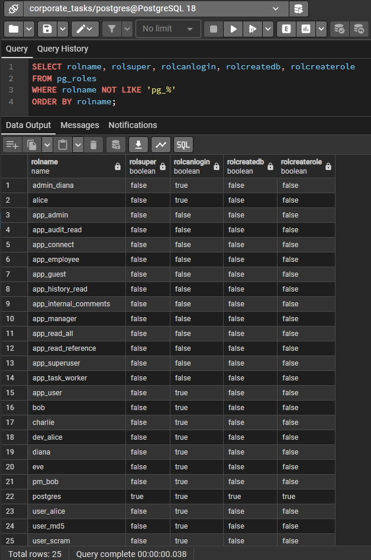
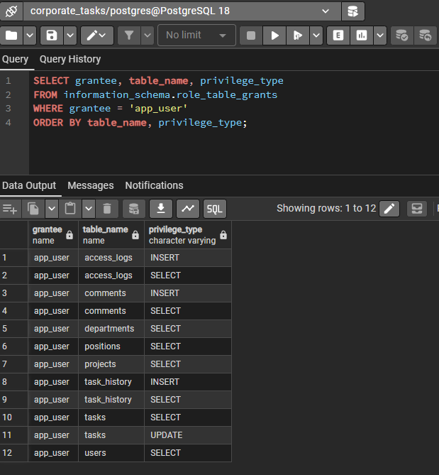
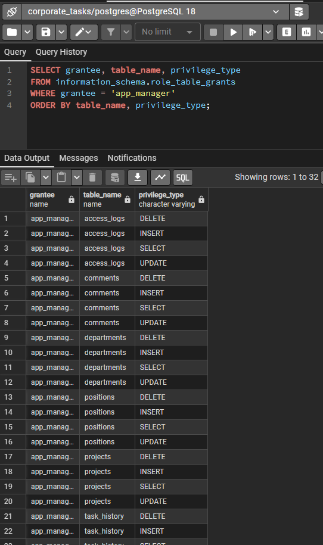
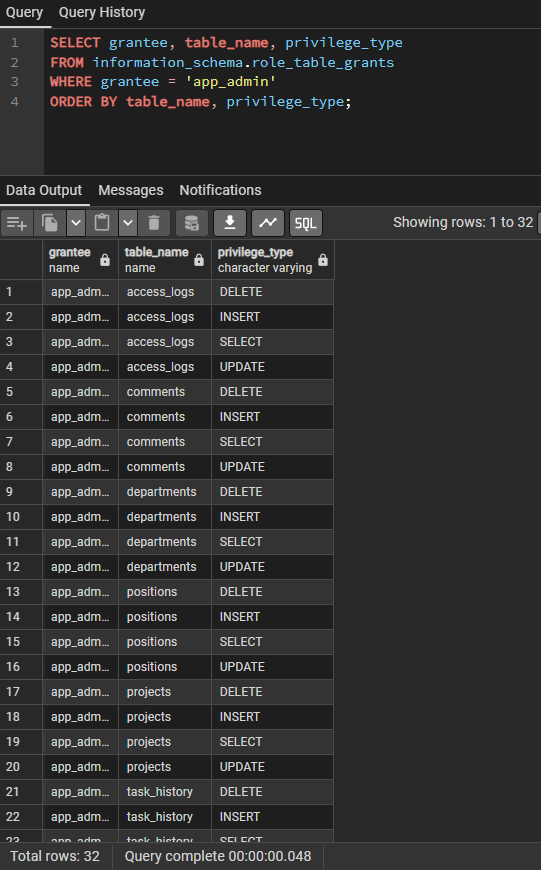
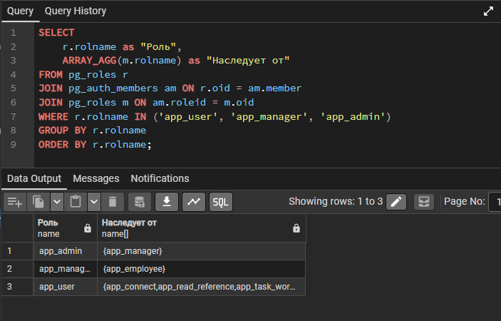
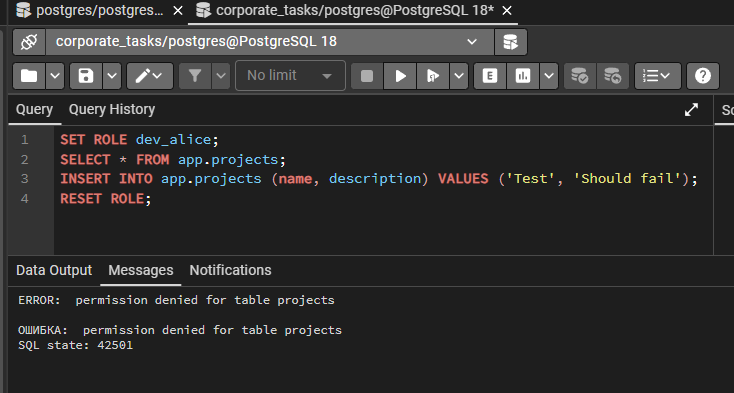
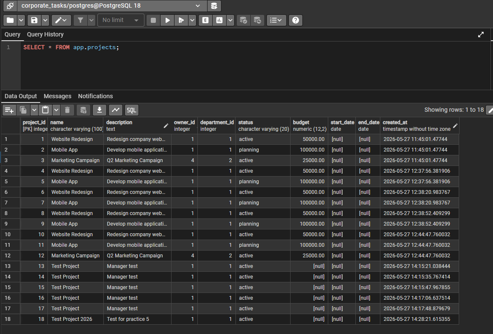
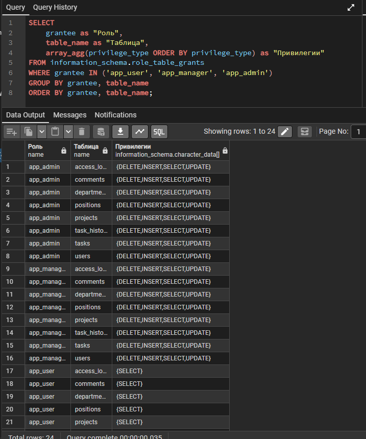

# Практическая работа №5: Детальная настройка привилегий

**Выполнила:** Еременко Анастасия  
**Группа:** 607-41  
**Дата:** 27.05.2026  

---

## Часть 1: Анализ текущих привилегий

### Задание 1.1. Аудит текущей системы

**Список всех ролей:**

**Права на таблицы:**

| Роль | Чтение | Запись |
|------|--------|--------|
| app_user | SELECT на все таблицы | INSERT (comments, logs), UPDATE (tasks) |
| app_manager | SELECT, INSERT, UPDATE, DELETE | Полный доступ |
| app_admin | SELECT, INSERT, UPDATE, DELETE | Полный доступ |

Права app_user: 

Права app_manager: 

Права app_admin: 

---

## Часть 2: Переработка системы привилегий

### Задание 2.2. Иерархия ролей-контейнеров

Созданы роли-контейнеры: `app_connect`, `app_read_reference`, `app_read_main`, `app_comments_full`, `app_task_write`, `app_project_write`, `app_history_full`, `app_access_log_write`, `app_full_access`

Иерархия: 

---

## Часть 3: Назначение привилегий

### Задание 3.1-3.3. Настройка ролей

| Роль | Наследует | Дополнительные права |
|------|-----------|---------------------|
| app_user | — | Чтение, комментарии, обновление статуса задач |
| app_manager | app_user | Управление проектами |
| app_admin | app_manager | Полный доступ, создание схем |

---

## Часть 5: Тестирование

### dev_alice (обычный пользователь)

- ✅ Чтение проектов — работает
- ❌ Вставка проекта — ошибка

Ошибка: 

### pm_bob (менеджер)

- ✅ Чтение проектов — работает
- ✅ Вставка проекта — успешно

Успех: 

---

## Часть 6: Финальный аудит

### Матрица привилегий

| Роль | SELECT | INSERT | UPDATE | DELETE |
|------|--------|--------|--------|--------|
| app_user | ✅ | ограниченно | ✅ (только задачи) | ❌ |
| app_manager | ✅ | ✅ | ✅ | ✅ |
| app_admin | ✅ | ✅ | ✅ | ✅ |

Матрица: 

---

## Вывод

Привилегии настроены по принципу минимальных прав. Обычный пользователь имеет только необходимые права, менеджер управляет проектами, администратор имеет полный доступ.
