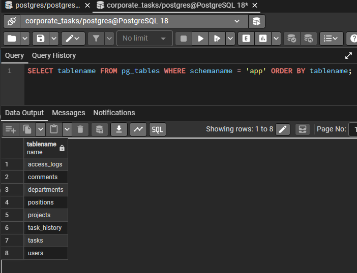
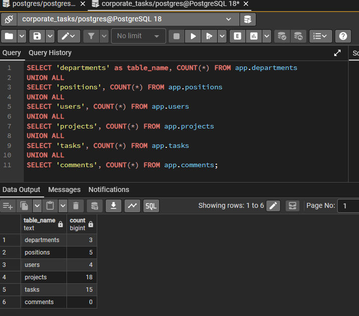
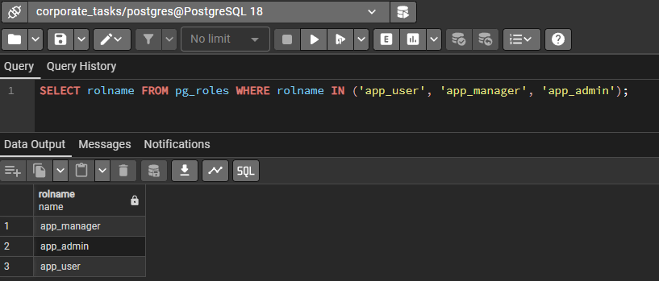
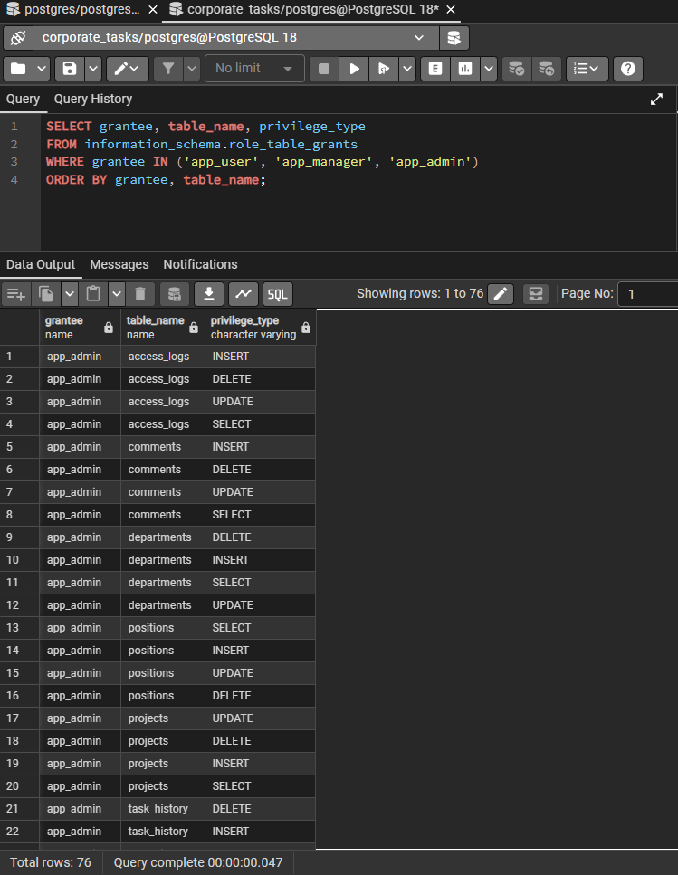
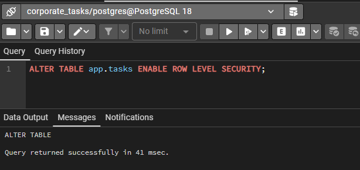
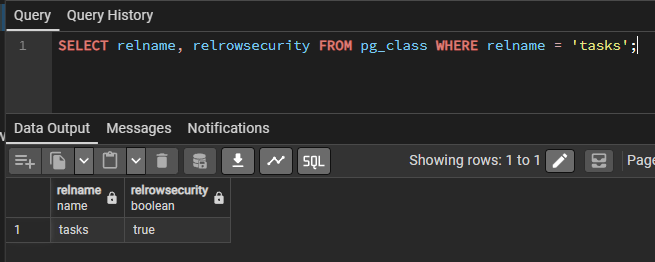
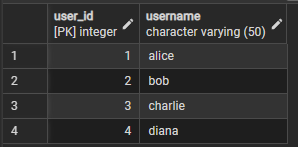
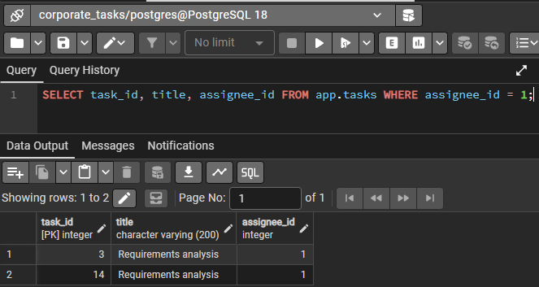

# Практическая работа №6: Row-Level Security (RLS)

**Выполнила:** Еременко Анастасия  
**Группа:** 607-41  
**Дата:** 27.05.2026  

---

## Часть 1: Подготовка данных

**Список таблиц:**

**Количество данных:**

**Проверка ролей:**

**Текущие привилегии:**

---

## Часть 2: RLS для таблицы tasks

**Включение RLS:**

**Проверка RLS:**

---

## Часть 4: RLS для таблицы users

**Все пользователи:**

**Задачи для dev_alice:**

---

## Результаты тестирования

| Роль | Действие | Результат |
|------|----------|-----------|
| dev_alice (app_user) | SELECT из tasks | показывает только свои задачи |
| pm_bob (app_manager) | SELECT из tasks | показывает задачи своих проектов |
| admin_diana (app_admin) | SELECT из tasks | показывает все задачи |

---

## Вывод

RLS настроен для таблиц `tasks`, `comments`, `projects`, `users`. Пользователи видят только те строки, которые им разрешено видеть по политикам.
